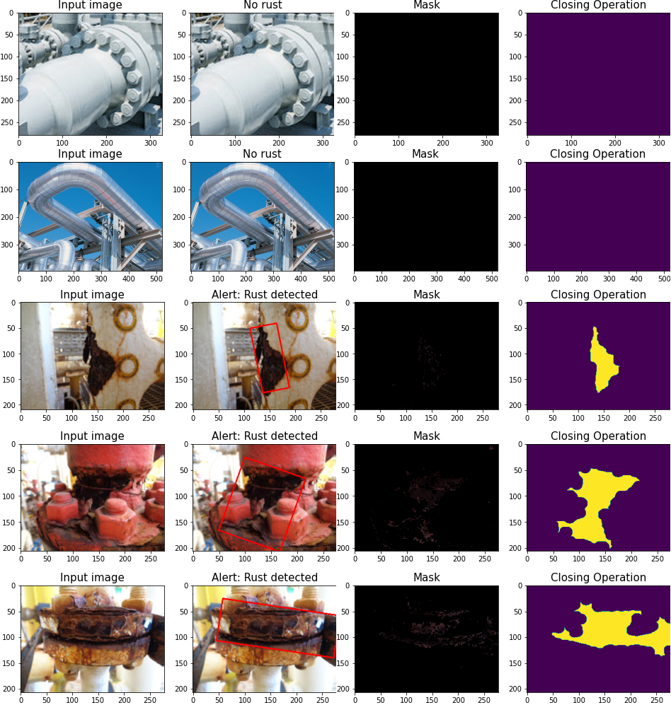

# 清明上河圖 (Along the River During the Qing Ming Festival)
A famous painting which belongs to Dynasty Song. The challenge here is to restore the blurry ancient painting.   

#### To enhance the image quality
* Brightness of the image
* Bring out the details

 

#### Original image 

 

#### Restored image 

 

#### Implementation
The notebook can be found [here](https://github.com/Sins-Repo/ImageProcessingII/blob/main/QingMing.ipynb)   

#### Techniques:
* Sharpening filter
* Contrast stretching
* Denoising

 
 

# Industrial Inspection
Detect rustic region and output a warning message

 

#### Sample output

 

#### Parameters
There are several parameters which can be changed for experiments. For instance
* The program is made to ignore small contours (measured by area). The area is tunable. In this program, 500 is chosen.
* The range of HSV color space 
* Morphological processing part

 

If we accept small contours ......  

 

Sometimes, we may need to set a larger value for the area  

 

#### Techniques:
* Segment rustic region using color space (concept of thresholding)
* Morphological processing
* Contour
